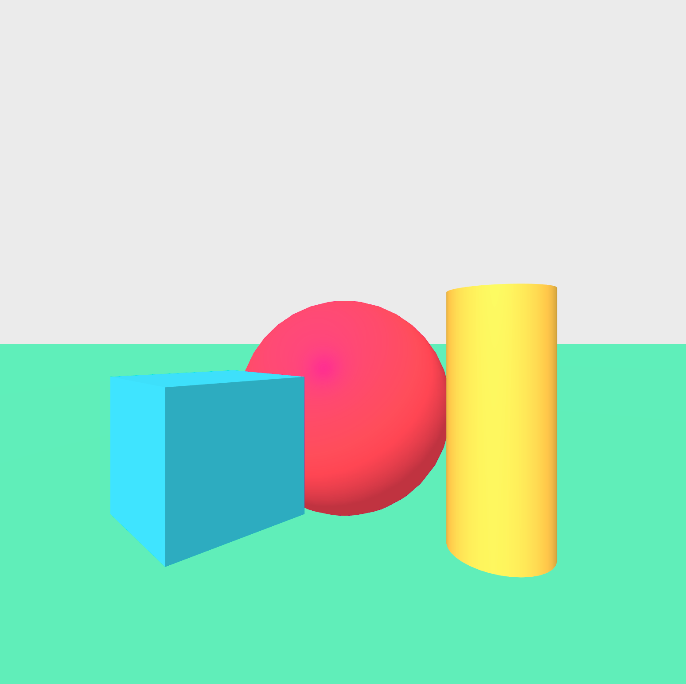
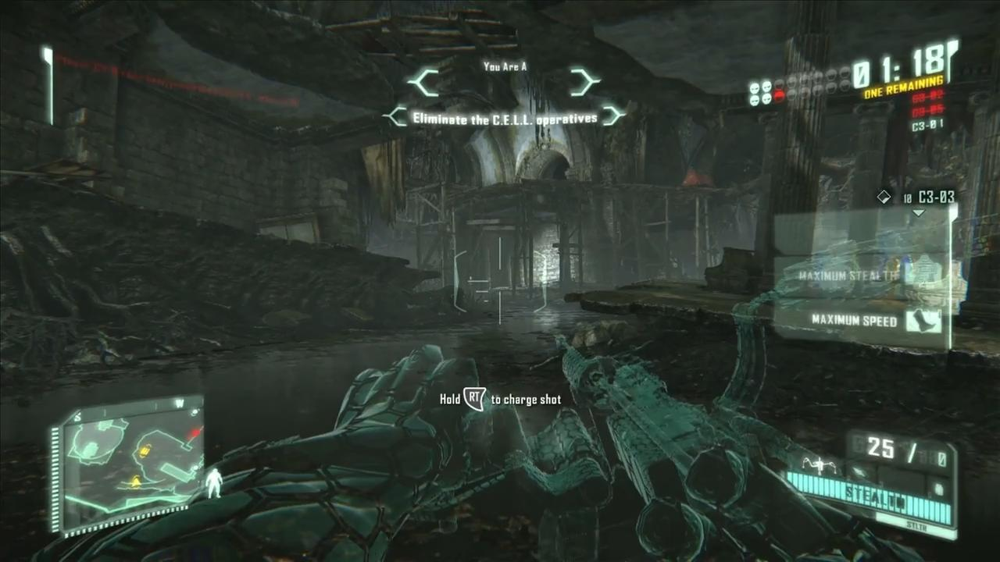
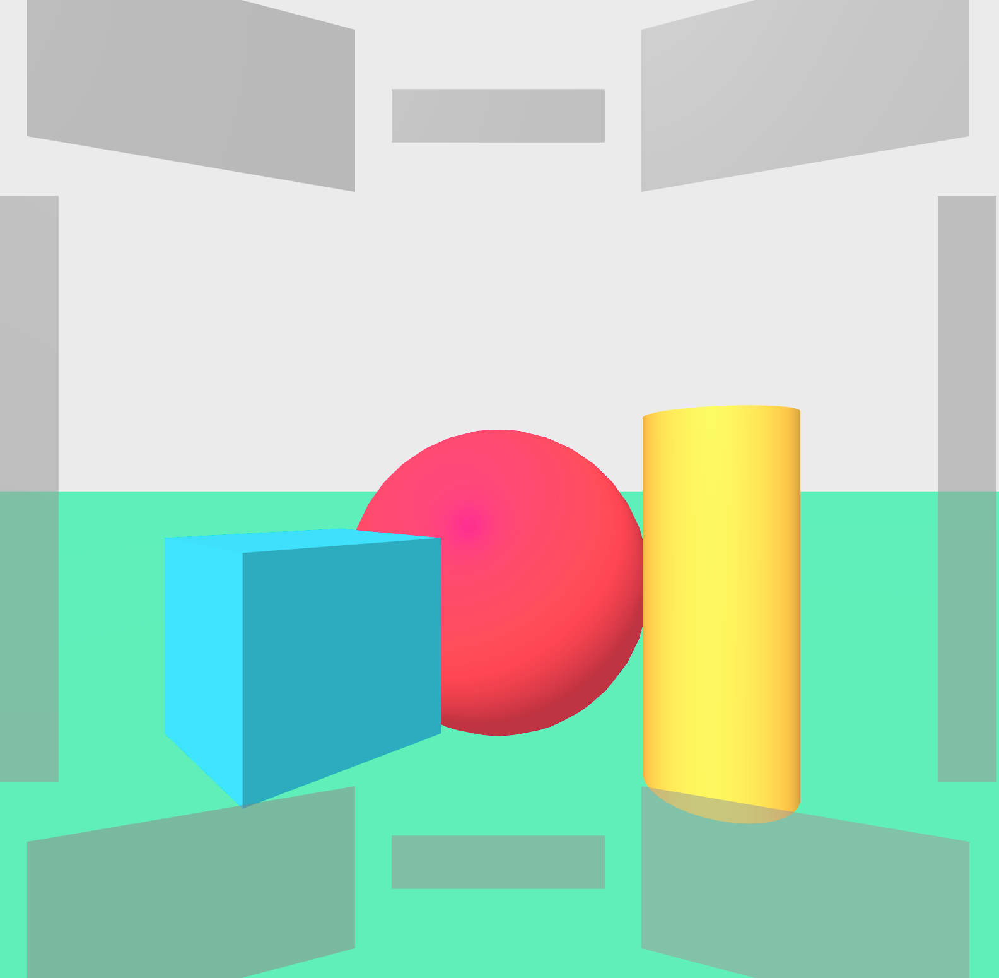

# How to build HUDs ?

This first step is to create a first version of the HUD using basic web technologies, google
cardboard and One Plus 5. In order to achieve this point, we just need to benchmark technologies
and implement a first prototype.

## Virtual world

First of all, we create a virtual world where we move in using cardboards.
[A-frame](https://aframe.io/) seems to be the most robust web technology.

We used the welcome setup of A-Frame in order to get a basic scene to test the HUD.

I use `live-server` and handle window click to set the fullscreen mode (see the full code [here](benchmark-vr-technologies-A-Frame)).
So now, as soon as I change a line in the code, the browser in my One Plus 5 embbeded in the Google
Cardboard is automatically refreshed. However, it leaves the fullscreen mode.
I only need to click on the button of the Google Cardboard (which
trigger a click on the browser window) and it comes back in fullscreen mode.

## Fixed elements

The main goal of HUDs is to display information in the user field of view so that he doesn't need
to look at a specific device to get the information. To enhance his vision, HUDs are composed of
several elements fixed from a user point of view as they were fixed to the headset.

We can positionate these elements like this:

* top left
* top
* top right
* right
* bottom right
* bottom
* bottom left
* left

Google Cardboard don't have a very large field of view (90°) in comparison of real field of view (210°)
so we can only put the elements at the maximum top, bottom, left and right.

Notice that the element are semi-transparent. These elements overlay a significant part of the screen
so transparency help the user to keep a large field of view. Moreover, the semi-transparency is useful
to avoid to catch the user attention.

Notice also that the components are oriented to created a sphere in front of the user face. The goal
is to simulate the glass of a helmet as a motorcycle or astronaut helmet. The elements are fixed very close
to the user head. It might make the user sick if he looks at the HUD too often. In the future, maybe we will
move back the HUD.

* https://aframe.io/docs/0.8.0/introduction/
* [VR headsets field of view](http://virtualrealitytimes.com/2017/03/06/chart-fov-field-of-view-vr-headsets/)

## Details

The previous section was about the position of the different elements. With a Google cardboard and a
One Plus 5, these elements are quite visible. However since they are in the peripheral vision, the
eye may be not able to really see the details of these components. So we need to try displaying details.

In order to display details, we will begin by displaying text.

* [text in A-Frame](https://aframe.io/docs/0.8.0/components/text.html)
